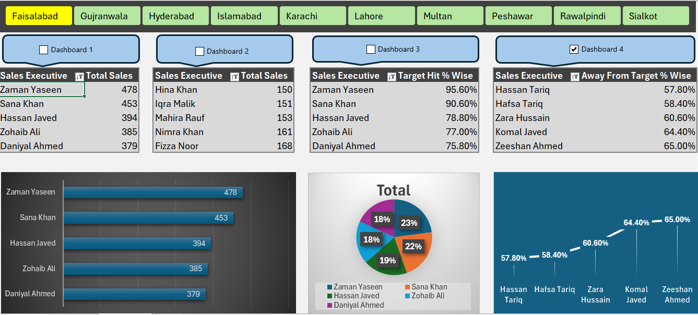
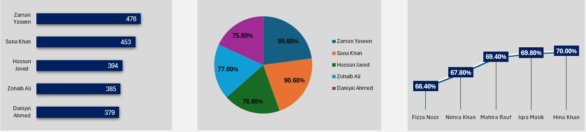
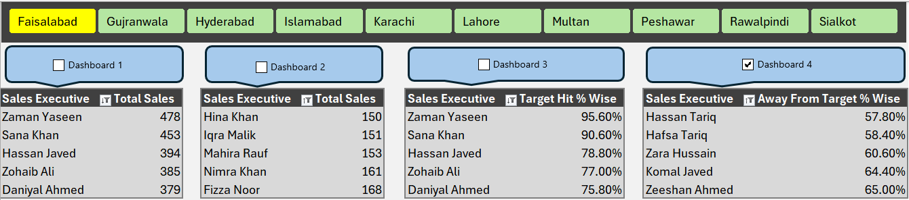

# 📊 Sales Performance Dashboard Project (Excel + VBA)

### 🎯 Objective:
To analyze and visualize regional sales performance using Microsoft Excel, Pivot Tables, Slicers, and VBA automation.

---

### 🧠 Tools & Techniques Used:
- Microsoft Excel (Data Cleaning, Pivot Tables)
- VBA (Macro Automation)
- Dashboard Design (KPIs, Target % Calculation)
- Charts & Visualization

---

### 📈 Features:
- Interactive dashboard with region and executive filters  
- Automatic percentage calculations (Target Hit %, Away From Target %)  
- Dynamic visuals showing daily and total sales performance  
- Macro-enabled automation for smooth updates  

---

### 📂 Project Files:
| File | Description |
|------|--------------|
| `Sales_Performance_Dashboard_Project_Final_Presentation.xlsm` | Main Excel dashboard with VBA automation |
| `Screenshot_1.png` | Full dashboard overview |
| `Screenshot_2.png` | Interactive filters (slicers & dashboard header) |
| `Screenshot_3.png` | KPI charts and insights visualization |

---

### 📊 Dataset Information:
- Simulated Pakistani sales data (100+ records)
- Sales regions: Lahore, Karachi, Islamabad, Faisalabad, Multan, etc.
- KPIs: Total Sales, Target, Target Hit %, Away From Target %

---

### 📸 Dashboard Preview:

#### 🖼️ Screenshot 1 — Full Dashboard Overview  

#### 🖼️ Screenshot 2 — Interactive Filters (Slicers & Dashboards Header)  

#### 🖼️ Screenshot 3 — Charts & Insights View  

---

### 🧠 Key Learnings:
- How to build dynamic Excel dashboards  
- Use of VBA for automation  
- Data storytelling through visuals  

---

### 👨‍💻 Author:
**Zaman Yaseen**  
[LinkedIn](www.linkedin.com/in/hafiz-zaman-yaseen-85057b36b) • Lahore, Pakistan